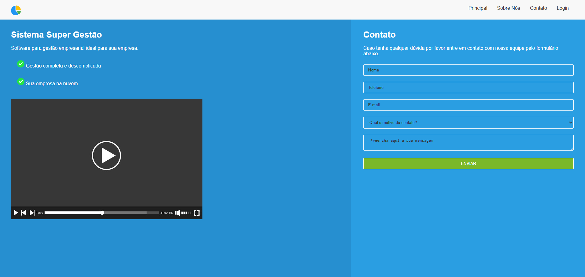
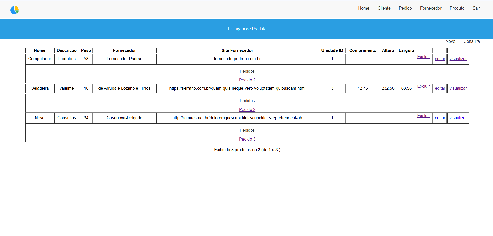
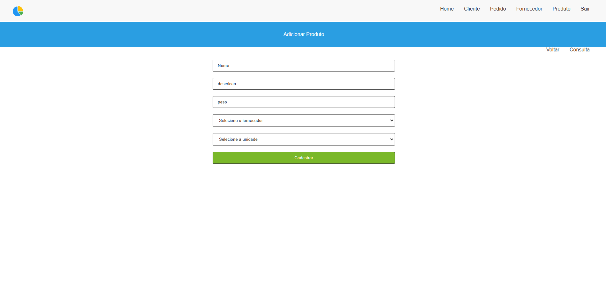
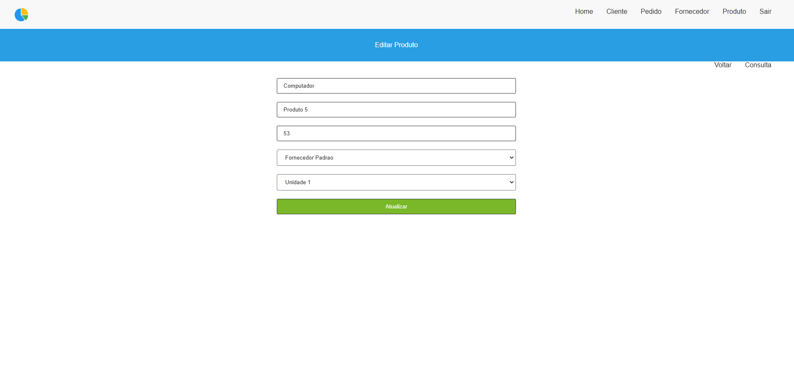

# Site Laravel Vue

Repositório feito para contribuir com meus estudos sobre o framework laravel utilizando vue.js

Para executar localmente:

> php artisan serve

## Estudos contemplados

1. Models
2. Controllers
3. Migrations + conexão com banco postgresql
4. Blade
5. Seeders
5. Factories
6. Requests
7. Middleware
8. ORM Eloquent

